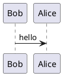

# 2. Построение пользовательского интерфейса (основы)
При создании первого приложения, вы могли увидеть интерфейс работы с **"внешним видом"** вашего Android-приложения. 

По умолчанию, файл `/layout/activity_main.xml` определяет разметку первой `"страницы" (activity)`, которую видит, с которой взаимодействует пользователь.

Рис. 1. Окно макета `Activity`.

Макет `Activity`, по умолчанию, определяет два виджета (`widgets`): 
- ConstraintLayout;
- TextView;
- p.s. Button (из примера выше) мы добавили **после** создания первого приложения.

Виджеты представляют собой структурные элементы пользовательского интерфейса. Существую различные виджеты по своим функциям\свойствам: вывод текста на экран, ввод текста, нажатие кнопки и другие взаимодействия с пользователем. В примере выше `Button`, `TextView` - это лишь разновидности виджетов.

Android SDK включает множество виджетов, которые являются дочерним классом класса `View`.

Рис. 2. Иерархия класса `View`. [Источник изображения](https://www.mathematik.uni-marburg.de/~thormae/lectures/graphics1/media/vectorart/android_class_hierarchy_view.svg).

# UML example

